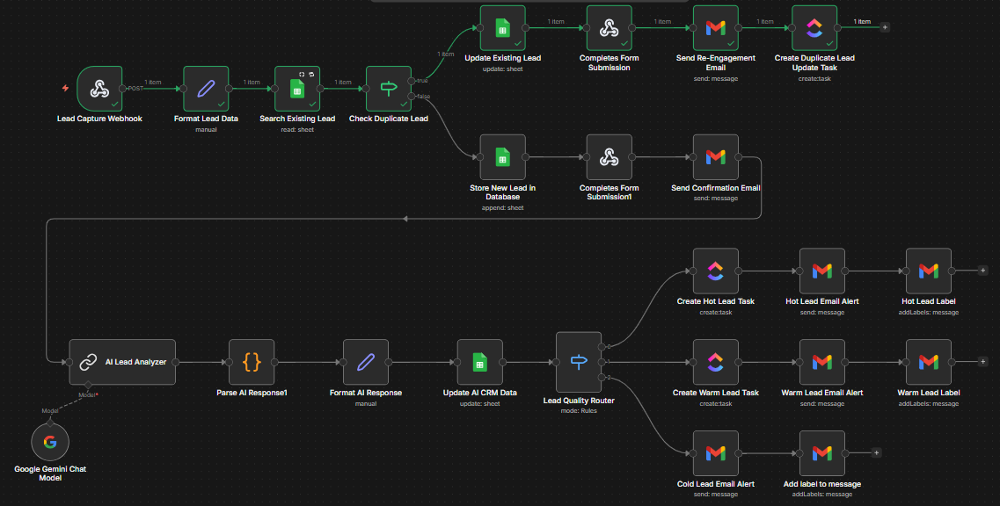
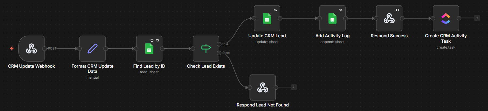
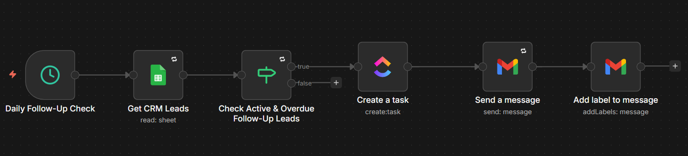
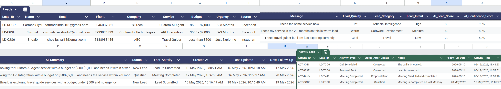
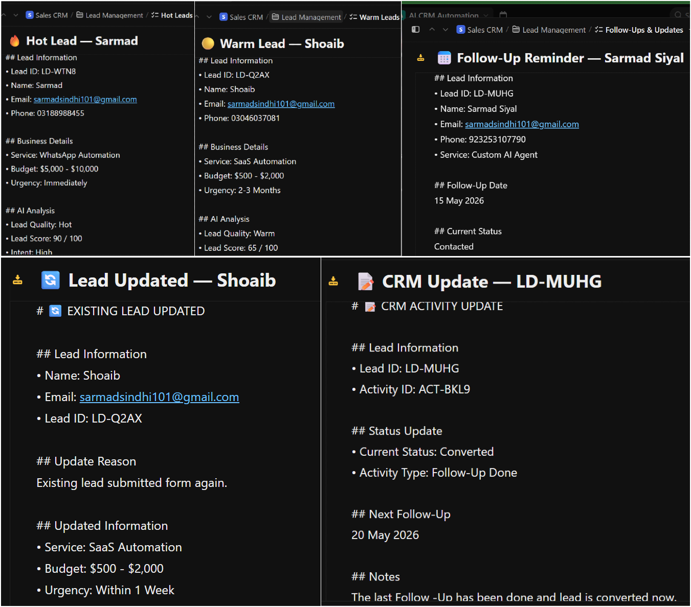
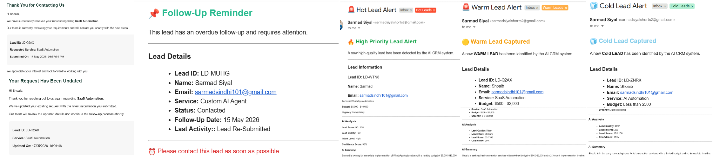
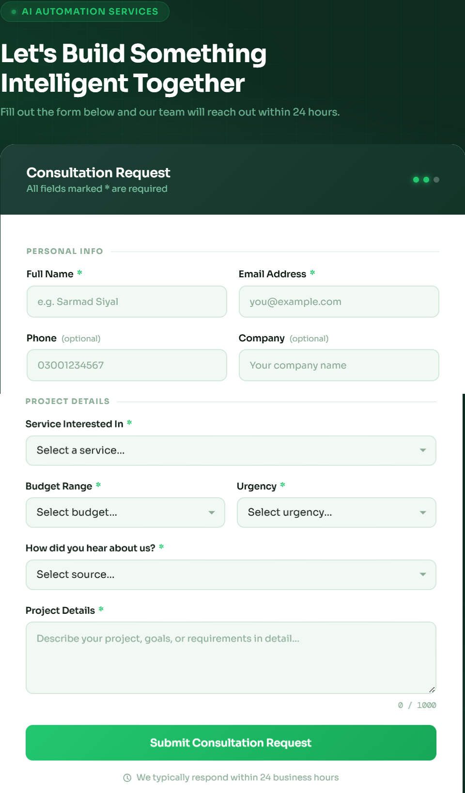
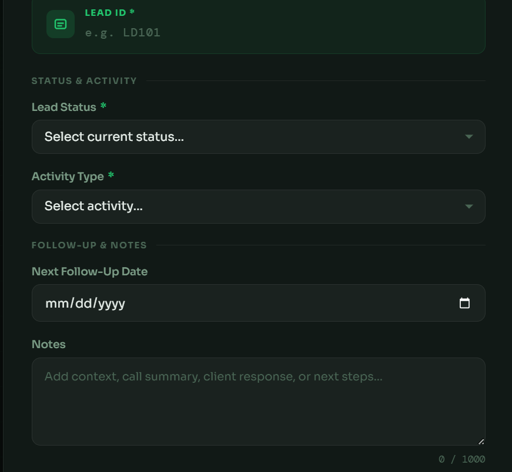

# 🚀 AI-Powered CRM Automation System

> Production-Ready AI CRM Automation Platform built with **n8n**, **AI Models (Groq/Gemini)**, **Google Sheets**, **Gmail**, **ClickUp**, and custom **HTML Forms**.

This system automatically captures leads, qualifies them using AI, scores lead quality, routes leads to internal teams, manages CRM activities, and automates follow-up reminders.

---

# 📌 Project Overview

This project simulates a real-world AI-powered CRM automation pipeline.

The system automatically:

- Captures leads from a frontend form
- Detects duplicate leads
- Updates existing CRM records
- Generates AI lead summaries
- Classifies leads as Hot, Warm, or Cold
- Calculates AI lead scores
- Detects lead intent
- Sends Slack notifications
- Create ClickUp tasks
- Tracks CRM activities
- Schedules follow-ups
- Detects overdue follow-ups automatically

The project was designed using production-level automation architecture and scalable workflow design.  

---

# ⚙️ Tech Stack

| Technology | Purpose |
|---|---|
| n8n | Workflow Automation |
| Groq AI | AI Lead Qualification |
| Gemini AI | Alternative AI Model |
| Google Sheets | CRM Database |
| Gmail | Email Notifications |
| ClickUp | Internal Team Management |
| HTML/CSS/JS | Frontend Forms |
| Webhooks | Real-Time Automation |

---

# Features

# AI Lead Capture System

- Frontend lead capture form
- Real-time webhook processing
- Duplicate lead detection
- AI lead qualification
- AI lead scoring
- AI confidence score
- AI lead summary generation
- AI lead intent detection
- AI lead routing
- Hot/Warm/Cold lead classification
- Professional email notifications
- Slack notifications

---

# CRM Management System

- Admin CRM update panel
- Lead existence validation
- Lead status updates
- CRM activity tracking
- Follow-up scheduling
- Activity logging
- Error handling
- Webhook response handling

---

# Automated Follow-Up Reminder System

- Daily automated checks
- Detect overdue follow-ups
- Ignore closed leads
- ClickUp tasks
- Gmail reminder notifications
- CRM follow-up automation

---

# 🧠 AI Features

The AI system automatically analyzes each lead and generates:

| Feature | Description |
|---|---|
| AI Summary | Short lead overview |
| Lead Category | Detects service category |
| Lead Intent | High / Medium / Low |
| Lead Score | Numerical lead score |
| Lead Quality | Hot / Warm / Cold |
| Confidence Score | AI confidence percentage |

---

# 🧠 AI Lead Classification Logic

| Lead Quality | Conditions |
|---|---|
| 🔥 Hot | High budget + urgent + strong intent |
| 🟡 Warm | Medium budget + medium intent |
| ❄️ Cold | Low urgency or low intent |

---

# 🏗️ Project Structure

```bash
ai-powered-crm-automation-system/
│
├── workflows/
│   ├── 01-ai-lead-capture-qualification.json
│   ├── 02-crm-management-activity-tracking.json
│   └── 03-followup-reminder-system.json
│
├── forms/
│   ├── lead-capture-form.html
│   └── admin-crm-update-form.html
│
├── assets/
│   ├── workflow-1-ai-lead-capture.png
│   ├── workflow-2-crm-management.png
│   ├── workflow-3-followup-reminder.png
│   ├── clickup-tasks.png
│   ├── gmail-messages.png
│   ├── crm-google-sheet.png
│   ├── lead-form.png
│   └── admin-form.png
│
├── documentation/
│   └── Documentation.pdf
│
├── README.md
│
└── .gitignore
```

---

# 🔥 Workflow Architecture

# 1️⃣ AI Lead Capture & Qualification Workflow

This workflow handles:

- Lead capture from frontend form
- Duplicate lead detection
- AI qualification
- AI lead scoring
- AI lead classification
- AI routing
- Gmail notifications
- ClickUp task creation
- Google Sheets storage

---

## ✅ Workflow Features

| Feature | Status |
|---|---|
| Webhook Trigger | ✅ |
| Duplicate Detection | ✅ |
| AI Qualification | ✅ |
| AI Lead Scoring | ✅ |
| AI Lead Classification | ✅ |
| AI Confidence Score | ✅ |
| Gmail Notifications | ✅ |
| ClickUp Integration | ✅ |
| Google Sheets Storage | ✅ |

---

## 🧠 AI Processing

The AI model receives:

- Name
- Email
- Phone
- Service Interested In
- Budget
- Urgency
- Source
- User Message

The AI then returns:

```json
{
  "summary": "",
  "category": "",
  "intent": "",
  "lead_score": 0,
  "lead_quality": "",
  "confidence_score": ""
}
```

---

## 🛠 AI Parsing Architecture

Instead of using Structured Output Parser, the project uses a custom JavaScript parser node because it is more stable with Groq and Gemini models.

### Architecture

```text
Basic LLM Chain
      ↓
Code Parser Node
      ↓
Set AI Fields
```

---

# 2️⃣ CRM Management & Activity Tracking Workflow

This workflow manages CRM updates from the admin panel.

---

## ✅ Features

- Update Lead Status
- Track Activities
- Schedule Follow-Ups
- Store CRM Activity Logs
- Gmail Notifications
- ClickUp Updates

---

## 📌 Supported Activities

- Email Sent
- Call Scheduled
- Call Completed
- Meeting Scheduled
- Proposal Sent
- Follow-Up Done
- Deal Closed

---

# 3️⃣ Automated Follow-Up Reminder Workflow

This workflow automatically checks follow-up dates daily and sends reminders to internal teams.

---

## ✅ Features

- Daily Schedule Trigger
- Date Validation
- Gmail Reminder Notifications
- ClickUp Reminder Tasks
- Follow-Up Tracking

---

## Follow-Up Date Logic

```javascript
{{
DateTime.fromFormat(
  $json["Next_Follow_Up"],
  "dd LLLL yyyy"
).toMillis() < DateTime.now().setZone('Asia/Karachi').toMillis()
}}
```

---

# 🆔 ID Generation System

## Lead ID

```javascript
LD-{{ Math.random().toString(36).substring(2,6).toUpperCase() }}
```

---

## Activity ID

```javascript
ACT-{{ Math.random().toString(36).substring(2,6).toUpperCase() }}
```

---

# Google Sheets Database Structure

The system uses two Google Sheets tabs.

---

# Sheet 1 — CRM_Leads

This sheet stores all lead and AI processing data.

## Main Fields

| Field Name |
|---|
| Lead_ID |
| Name |
| Email |
| Phone |
| Service |
| Budget |
| Urgency |
| Message |
| Lead_Status |
| Next_Follow_Up |
| AI_Summary |
| Lead_Category |
| Lead_Intent |
| Lead_Quality |
| AI_Lead_Score |
| AI_Confidence_Score |
| Created_At |
| Updated_At |

---

# Sheet 2 — CRM_Activities

This sheet stores CRM activity logs.

## Main Fields

| Field Name |
|---|
| Activity_ID |
| Lead_ID |
| Activity_Type |
| Lead_Status |
| Notes |
| Next_Follow_Up |
| Updated_By |
| Updated_At |

---

# Forms Included

# Lead Capture Form

Features:

- Real-time validation
- Professional UI
- Required field validation
- Dynamic “Other” field support
- Webhook integration
- Error handling
- Success screen
- Duplicate lead handling

---

# Admin CRM Update Form

Features:

- CRM lead updates
- Activity logging
- Status updates
- Follow-up scheduling
- Lead validation
- Error handling
- Toast notifications

---

# 📬 Gmail Labels Used

| Label | Purpose |
|---|---|
| Hot Leads | High-priority leads |
| Warm Leads | Medium-priority leads |
| Cold Leads | Low-priority leads |
| Lead Follow-Ups | Follow-up reminders |

---

# 📋 ClickUp Lists

| List Name | Purpose |
|---|---|
| Hot Leads | High-priority lead tasks |
| Warm Leads | Medium-priority lead tasks |
| Follow-Ups & Updates | Follow-up reminders & CRM updates |

---

# 🛡️ Production-Level Features

✅ AI Qualification  
✅ AI Routing  
✅ AI Lead Scoring  
✅ AI Confidence Score  
✅ Duplicate Lead Detection  
✅ Error Handling  
✅ Gmail Automation  
✅ ClickUp Notifications  
✅ Automated Follow-Ups  
✅ CRM Activity Tracking  
✅ Real-Time Webhooks  
✅ Dynamic Forms  
✅ Production-Ready Architecture  

---

# 📸 Screenshots

## AI Lead Capture Workflow



---

## CRM Management Workflow



---

## Follow-Up Reminder Workflow



---

## Google Sheets CRM



---

## ClickUp Tasks



---

## Gmail Notifications



---

## Lead Capture Form



---

## Admin CRM Form



---

# 🎯 Real-World Use Cases

This system can be used for:

- AI Automation Agencies
- Marketing Agencies
- SaaS Companies
- CRM Automation
- Lead Management Systems
- Sales Teams
- Consulting Businesses

---

# 🚀 Future Improvements

- WhatsApp Notifications
- Voice AI Integration
- Multi-user CRM Dashboard
- PostgreSQL Database
- AI Sales Recommendations
- Calendar Integrations
- Analytics Dashboard

---

# ⚡ Setup Instructions

## 1️⃣ Clone Repository

```bash
git clone https://github.com/yourusername/ai-powered-crm-automation-system.git
```

---

## 2️⃣ Import n8n Workflows

Import all workflow JSON files from:

```text
/workflows
```

---

## 3️⃣ Configure Credentials

Add credentials for:

- Gmail
- Google Sheets
- ClickUp
- Groq API
- Gemini API

---

## 4️⃣ Update Webhook URLs

Replace webhook URLs in HTML forms with your n8n webhook URLs.

---

## 5️⃣ Run Workflows

Activate all workflows in n8n.

---

# 📚 Documentation

Full project documentation is available in:

```text
/documentation/Documentation.pdf
```

---

# 👨‍💻 Author

**AI CRM Automation System**  
Built as a production-ready AI automation project using n8n and modern AI workflow architecture.

---

# ⚠️ Important Note

The workflow JSON files included in this repository **DO NOT contain credentials**.

For security reasons, you must add your own:

- Gmail Credentials
- Google Sheets Credentials
- ClickUp Credentials
- Groq API Key
- Gemini API Key

before running the workflows.

---

# License

This project is for educational and portfolio purposes.
